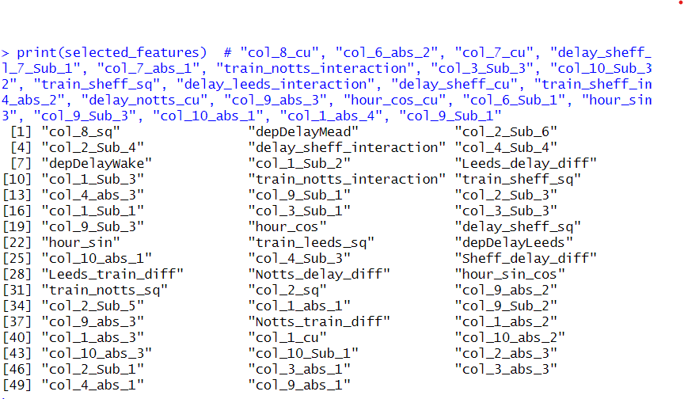
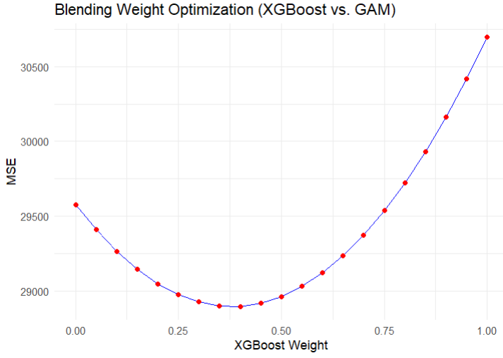
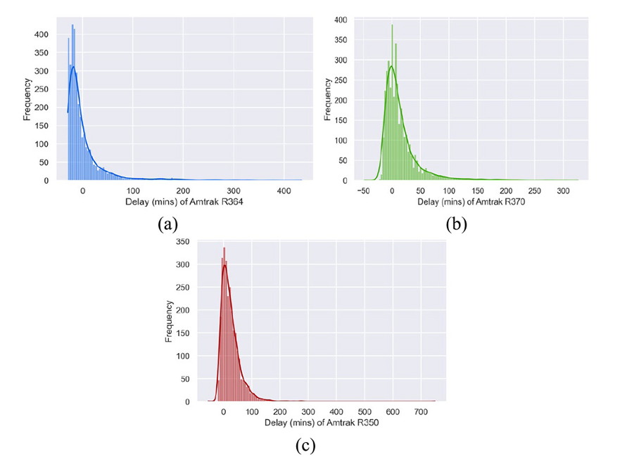
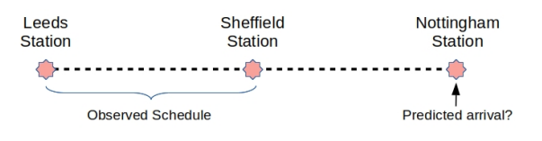
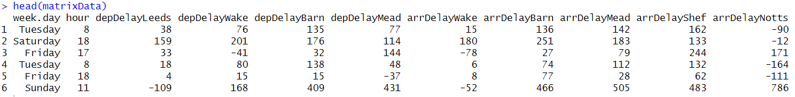
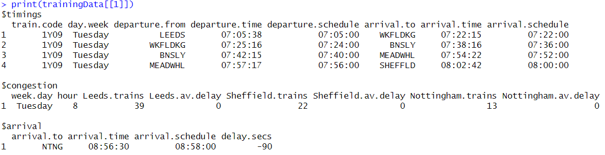
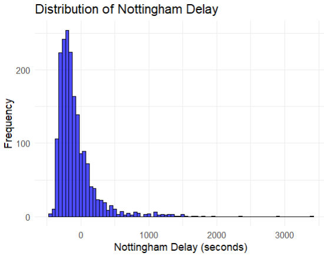
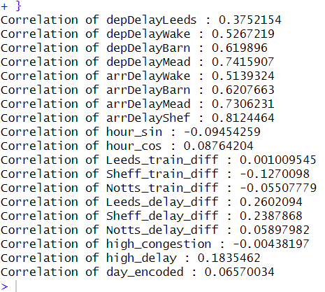

# Train Delay Prediction

Predicting arrival delay at Nottingham for trains travelling the Leeds → Nottingham route, using engineered timing/congestion features with a blended XGBoost + GAM model. Built as coursework for MATH4069 (Statistical Machine Learning), University of Nottingham — **winning entry** for the Train Delay Challenge in our cohort.

**Author:** Ayush Saxena <br/>
[reignofayush@gmail.com](mailto:reignofayush@gmail.com)

---

## Overview

This project predicts how early or late a train will arrive at Nottingham, given scheduled and real-time timing data for trains travelling Leeds → Wakefield → Barnsley → Meadowhall → Sheffield → Nottingham, plus historical congestion patterns at each station. The task is scored on MSE, which makes it sensitive to large/extreme delays rather than typical ones — a detail that shaped several modeling decisions below.

I independently designed and implemented the full modeling pipeline in this repo: feature engineering, feature selection, model development (XGBoost, GAM, and blending), and hyperparameter tuning, within a 4-person coursework team.

## Dataset

- **Training set:** 1,859 observations · **Test set:** 465 observations · **Historical congestion:** 126 observations (one per day-of-week × hour combination)
- Two data sources per observation: **endogenous** (arrival/departure delays at each station along the route) and **exogenous** (historical congestion — average delay and average train count per station, by day and hour)
- No missing values in the raw training data; missing values later introduced by feature engineering (via division formulas) were imputed with training-set means

## Methodology & Iteration

The 5-week build genuinely changed direction more than once — worth showing since the dead ends taught as much as the wins:

| Week | Approach | Features | Result (Test MSE) |
|---|---|---|---|
| 1 | Linear Regression baseline | 1 | 30,700 |
| 2 | XGBoost, full feature engineering pass (delays, congestion ratios, cyclic hour encoding, day encoding) | 19 | **29,222** |
| 3 | XGBoost + aggressive outlier removal | 16 | 70,239 — outlier removal backfired badly |
| 4 | XGBoost, 117 new polynomial/interaction features → correlation-pruned → RFE | 25 | 29,816 |
| 5 | **XGBoost + GAM blend**, corrected feature-redundancy function, RFE re-run | 50 | **29,341 (final)** |

Key turning points:
- **Outlier removal (Week 3) hurt performance** — dropping "outlier" delays it turns out wasn't outlier noise, it was signal the test set also contained. Since MSE penalizes large errors heavily, keeping the extreme values in training was actually necessary for generalizing to the test set's own extremes.
- **Feature engineering had far more impact than model choice.** Squaring, cubing, and taking pairwise differences/products of the core delay and congestion features (117 new features) moved the needle more than any amount of hyperparameter tuning did.
- **PCA was tried and discarded.** Compressing to 20 principal components captured ~88% of variance but didn't improve results over the original named features — high correlation between features didn't mean they were redundant in a way PCA could exploit.
- **Hyperparameter tuning gave no reliable lift** without a well-targeted search grid, given limited compute for defining one — RFE-based feature selection gave more consistent improvement than grid search did.
- **GAM (which the team hadn't used before) slightly outperformed XGBoost** on this data despite XGBoost's usual edge on skewed targets — a reminder that trying an unfamiliar model class is sometimes worth the risk.

## Final Model

**Blended XGBoost + GAM**, trained on 50 features selected via Recursive Feature Elimination (from an original pool of 117 engineered features, correlation-pruned to 61, then reduced via RFE):

- Features engineered from the 8 raw delay columns and 6 congestion columns: polynomial terms (squares, cubes), pairwise differences and products, cyclic sin/cos hour encoding, and binary weekday/weekend encoding (found to correlate better with delay than 3-way or 7-way day encodings)
- XGBoost and GAM trained independently on the same 50 features, then blended with manually chosen weights (an automated optimal-weight search was run for reference, but manual weights based on model understanding performed better on the held-out set)
- **Final test MSE: 29,341**





## Exploratory Data Analysis







## Key Learnings

- Numerical features consistently outperformed categorical ones for this task
- Delays at stations closer to Nottingham had a stronger effect on final arrival delay than those further up the route
- More exogenous data (weather, incident reports) would likely help more than further feature engineering on the existing endogenous data
- High feature correlation doesn't imply redundancy — pruning too aggressively based on correlation alone risks dropping genuinely useful signal

## Tech Stack

`R` · `xgboost` · `mgcv (GAM)` · `caret` · `ggplot2` · `dplyr` · `DescTools`

## Repository Structure

```
├── Trains_Delay_Prediction.R               # Full pipeline: EDA, feature engineering, modeling, blending
├── images/                                 # Result plots referenced in this README
├── Train Delay Report Excerpt.pdf          # Excerpt of the original coursework report
└── README.md
```

## Full Write-Up

For the complete analysis narrative (problem framing, week-by-week EDA, and reasoning behind each modeling decision), see [`Train Delay Report Excerpt.pdf`](Train_Delay_Report_Excerpt.pdf) — an excerpt of the original coursework report covering the Train Delay section only.

## Reproducing Results

The dataset (`trainsData.RData`) was provided as part of university coursework and is not included in this repo. The script expects it in the project root — open via an RStudio project (or set your working directory to the repo root) so the relative `load("trainsData.RData")` call resolves, then run `Trains_Code.R` top to bottom.

---

*Part of Ayush Saxena's ML/Data Science portfolio — [ayush-saxena.dev](https://ayush-saxena.dev)*